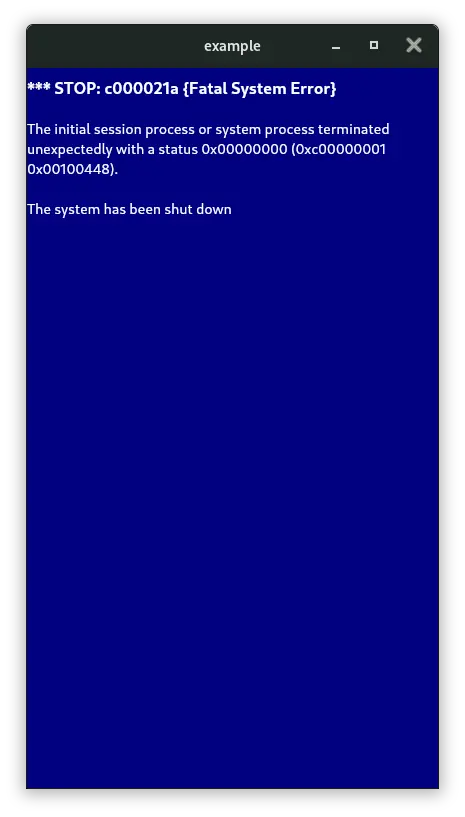
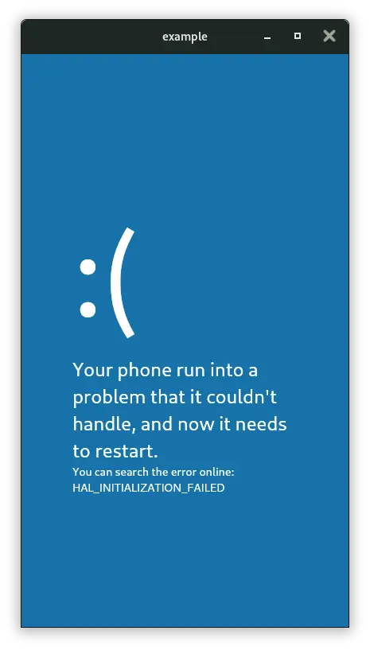

Have you ever dreamt to have the infamous **Blue Screen Of Death** in your Flutter app?

Thanks to `windows_blue_screens`, you can now give the Windows experience to your multiplatform app (Android, iOS, MacOS, Linux, Web...).

## Features

| Windows 2000 | Windows 8|
---------------|-----------
|           |  |


## Usage

Wrap your `MaterialApp` with 

```dart 
WindowsBlueScreen(
    randomMode: true, // if you trigger the blue screen randomly or manualy
    mustCrashBeforeSeconds: 600, // the blue screen must appears before 600 seconds
    child: MaterialApp(),
)
```

To trigger manually the blue screen, use the following code:

```dart
WindowsBlueScreen.of(context).triggerBlueScreen();
```
